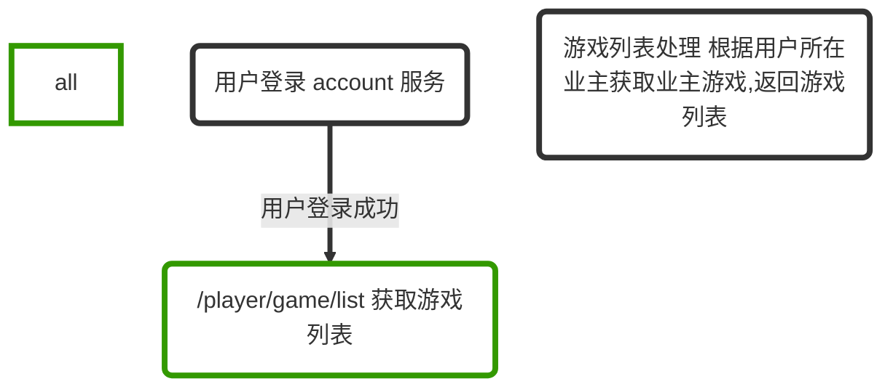

### 游戏大厅后端 服务

```mermaid


graph TD
    classDef default fill:#FFFFFF,stroke:#333,stroke-width:4px;

    class login default;
    style all fill:#FFFFFF,stroke:#390,stroke-width:4px
    style gameList fill:#FFFFFF,stroke:#390,stroke-width:4px
    
    login(用户登录 account 服务)
    gameList(/player/game/list 获取游戏列表) 
    login ==用户登录成功==>  gameList
    gameListHandler(游戏列表处理 根据用户所在业主获取业主游戏,返回游戏列表)

```

